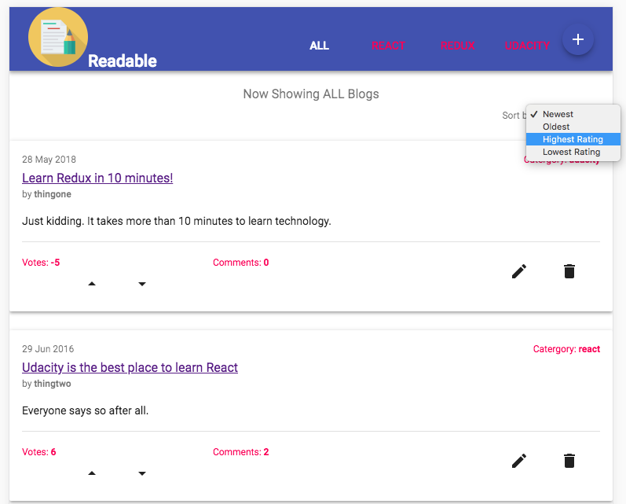
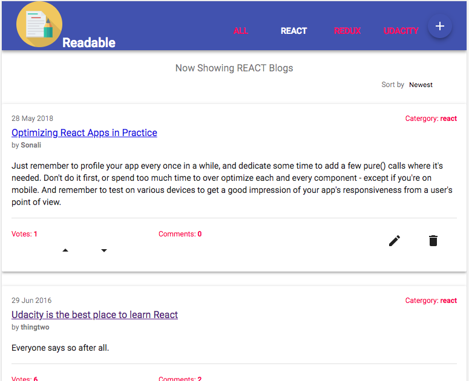
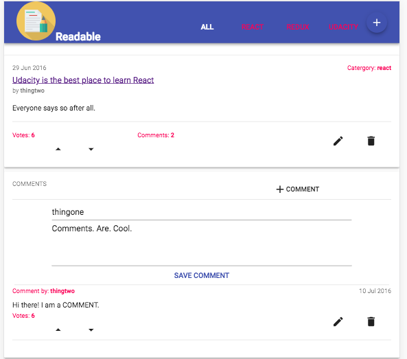
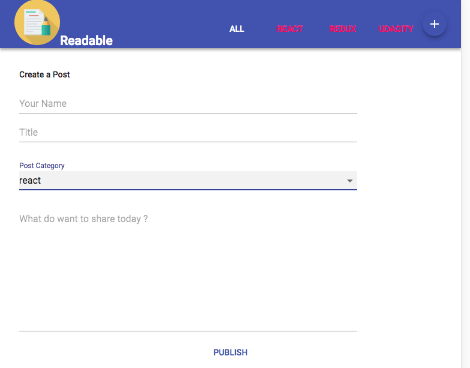

## User Story

Leverage ​the ​strengths ​of ​Redux ​to ​build ​a ​“Readable” ​application ​where ​users ​can ​post ​text ​content ​and
comment ​on ​each ​other's ​posts. ​You’ll ​build ​this ​dynamic ​application ​from ​scratch ​while ​combining ​the ​state
management ​features ​of ​Redux ​with ​the ​declarative ​component ​model ​from ​React. ​When ​complete, ​you’ll
be ​able ​to ​submit ​your ​own ​posts, ​comment ​on ​existing ​posts, ​and ​edit ​and ​delete ​posts ​and ​comments.

This project was bootstrapped with [Create React App](https://github.com/facebookincubator/create-react-app) and [Material UI](https://material-ui-next.com/).

Icons made by [DinosoftLabs](https://www.flaticon.com/authors/dinosoftlabs) from [[https://www.flaticon.com/](www.flaticon.com) is licensed by [http://creativecommons.org/licenses/by/3.0/](Creative Commons BY 3.0) 

        

## Installation and Launching
clone the Project - git clone https://github.com/sonalikatara/readable

install the dependencies - npm install

start the project with yarn - yarn start

listen the server on http://localhost:3000

## The Views

The application should has four views:

### Default (Root)

* lists all available categories, which links to a category view for that category

* it lists all of the posts

* it has a control for changing the sort method for the list, order by voteScore and order by timestamp

*  has a control for adding a new post

### Category View

identical to the default view, but filtered to only include posts with the selected category

### Post Detail View

* shows the details of a post, including: Title, Body, Author, timestamp (in user readable format), and vote score

* lists all of the comments for that post

* has controls to edit or delete the post

* has a control to add a new comment.

* implements comment form inline

* comments have controls for editing or deleting

### Create/Edit Post View

* has a form to create new post or edit existing posts

* when editing, existing data is populated in the form

### Post/Comment UI

Posts and comments, in all views where they are displayed, should display their current score and should have controls to increment or decrement the voteScore for the object. Posts should display the number of comments associated with the post.

## License

The contents of this repository are covered under the [MIT License](LICENSE).
